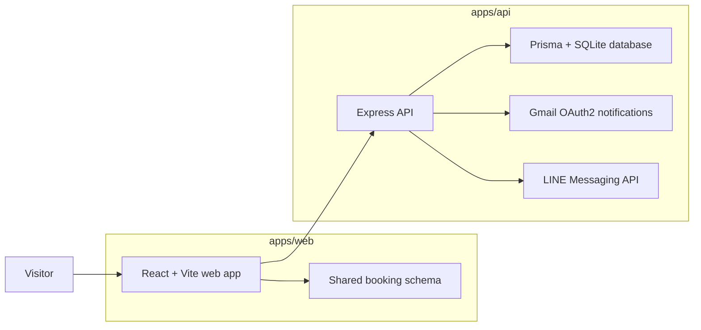

# Salon Shizuka

Salon Shizuka is a monorepo for a Japanese salon website with a React/Vite front end, an Express/Prisma API, and a small shared schema package that keeps booking validation consistent across the stack.

## Documentation map

- [Docs index](docs/README.md) — the main documentation hub.
- [Web app README](apps/web/README.md) — front-end setup, scripts, deployment, and client env vars.
- [API README](apps/api/README.md) — backend setup, scripts, env vars, endpoints, database, and deployment.
- [Shared package README](apps/shared/README.md) — shared Zod schemas and validation contracts.
- [Contributing guide](CONTRIBUTING.md) — the canonical contribution workflow.

## Architecture



## Repository layout

- `apps/web` — single-page React app with routing, booking state, newsletter signup, and the production build output in `deploy/`.
- `apps/api` — Express server, Prisma schema, validation middleware, email/LINE notification services, and integration scripts.
- `apps/shared` — source-of-truth Zod schemas used by the web app and mirrored in the API validation layer.

## Installation

Install dependencies once at the repository root:

```bash
npm install
```

The checked-in lockfiles make root installation the intended entry point.

## Local development

Run the front end and API in separate terminals:

```bash
npm run dev:web
npm run dev:api
```

The web app runs on Vite’s default port `5173`, and the API listens on `4000` by default.

## npm scripts

### Root scripts

| Script | What it does |
| --- | --- |
| `npm run dev:web` | Starts the Vite dev server in `apps/web`. |
| `npm run dev:api` | Starts the Express API in `apps/api`. |
| `npm run build:web` | Builds the web app. |
| `npm run build:web:deploy` | Builds the web app using the deploy build script. |
| `npm run build:api` | Compiles the API to `apps/api/dist`. |
| `npm run type-check` | Runs TypeScript checks for both workspace apps. |
| `npm test` | Placeholder script that currently exits with an error. |

For the complete per-app script reference, see the [web app README](apps/web/README.md) and [API README](apps/api/README.md).

## Environment variables

The actual runtime configuration lives in the app-level READMEs:

- [Web environment variables](apps/web/README.md#environment-variables)
- [API environment variables](apps/api/README.md#environment-variables)

## Deployment

- **Web**: `apps/web/vite.config.ts` builds to `apps/web/deploy`, and `netlify.toml` publishes that folder with a single-page app redirect.
- **API**: build with `npm run build:api`, then start with `npm run start` inside `apps/api` on a Node host with the required environment variables configured.
- **Production API URL**: the committed `apps/web/.env.production` points the front end at `https://salon-shizuka-production.up.railway.app`, so production deployments should keep that base URL in sync with the live API host.

## Contributing

See [CONTRIBUTING.md](CONTRIBUTING.md) for the working agreement, validation checklist, and pull request expectations. The docs mirror lives at [docs/CONTRIBUTING.md](docs/CONTRIBUTING.md).

## Related source

- [Booking schema contract](apps/shared/schemas/bookingSchema.ts)
- [Documentation index](docs/README.md)
