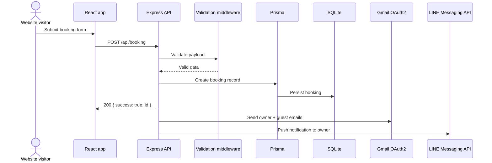

# API

This package contains the Salon Shizuka backend: an Express server, Prisma models, booking and newsletter endpoints, and background notification delivery through Gmail and LINE.

## Architecture



## Setup

1. Install dependencies from the repository root with `npm install`.
2. Copy `apps/api/.env.example` to `apps/api/.env.local`.
3. Fill in the required secrets and database URL.
4. Run `npm run dev:api` from the repository root, or `npm run dev` inside `apps/api`.

The API loads `.env` first and then lets `.env.local` override it. The `postinstall` script also copies `.env.local` to `.env` when that file exists.

## npm scripts

| Script | What it does |
| --- | --- |
| `npm run dev` | Starts the API with `ts-node-dev` and auto-restarts on changes. |
| `npm run build` | Compiles TypeScript into `dist/`. |
| `npm run start` | Runs `prisma db push` for the current schema, then starts `dist/app.js`. |
| `npm run db:generate` | Regenerates the Prisma client. |
| `npm run db:push` | Pushes the Prisma schema to the configured database. |
| `npm run db:studio` | Opens Prisma Studio. |
| `npm run postinstall` | Copies `.env.local` to `.env` when present. |
| `npm run test:newsletter` | Sends a newsletter notification through an Ethereal test transporter. |

## Environment variables

All variables below are validated at startup in `src/config/env.ts`.

| Variable | Required | Purpose |
| --- | --- | --- |
| `PORT` | No | API port. Defaults to `4000`. |
| `CORS_ORIGIN` | No | Allowed front-end origin. Defaults to `http://localhost:5173`. |
| `DATABASE_URL` | Yes | Prisma datasource URL. The example file uses SQLite: `file:./dev.db`. |
| `GMAIL_USER` | Yes | Gmail address used as the notification sender. |
| `GMAIL_CLIENT_ID` | Yes | Gmail OAuth2 client ID. |
| `GMAIL_CLIENT_SECRET` | Yes | Gmail OAuth2 client secret. |
| `GMAIL_REFRESH_TOKEN` | Yes | Gmail OAuth2 refresh token. |
| `OWNER_EMAIL` | Yes | Destination address for owner notifications. |
| `LINE_CHANNEL_ACCESS_TOKEN` | Yes | LINE Messaging API access token. |
| `LINE_OWNER_USER_ID` | Yes | LINE user ID used for push notifications. |
| `NEWSLETTER_NOTIFY_EMAIL` | Yes | Newsletter notification address validated at startup. The current newsletter mail flow still sends to `OWNER_EMAIL`. |

## API endpoints

### `GET /health`

Returns a basic liveness response:

```json
{ "status": "ok", "ts": "2026-06-27T00:00:00.000Z" }
```

### `POST /api/booking`

Creates a booking record and triggers background notifications.

Request body:

```json
{
  "name": "Jane Doe",
  "email": "jane@example.com",
  "date": "2026-06-27",
  "time": "10:30",
  "services": [{ "id": "cut", "name": "Standard Cut", "price": 6050 }],
  "addons": [{ "id": "treatment", "name": "Treatment", "price": 2200 }]
}
```

Response:

```json
{ "success": true, "id": "clx..." }
```

Validation failures return `400` with field-level issues. Rate limiting returns `429`.

### `POST /api/newsletter`

Creates a newsletter subscription if the email is new, then sends an owner notification.

Request body:

```json
{ "email": "jane@example.com" }
```

Response:

```json
{ "success": true }
```

Validation failures return `400` with field-level issues. Rate limiting returns `429`.

## Data model

Prisma stores two tables:

- `Booking` — `name`, `email`, `date`, `time`, JSON-stringified `services` and `addons`, server-calculated `total`, and `createdAt`.
- `Newsletter` — unique `email`, `source`, and `createdAt`.

The booking total is recalculated on the server from `services` and `addons`; the client never supplies the authoritative total.

## Deployment

1. Set production environment variables on the host.
2. Build the app with `npm run build`.
3. Start the compiled server with `npm run start`.
4. Point the front end’s `VITE_API_BASE_URL` at the deployed host.

Because the API uses `trust proxy`, it is ready to run behind a reverse proxy or platform load balancer.

## Related source

- [Documentation index](../../docs/README.md)
- [Root README](../../README.md)
- [Contributing guide](../../docs/CONTRIBUTING.md)
- [Web app README](../web/README.md)
- [Shared booking schema](../shared/schemas/bookingSchema.ts)
