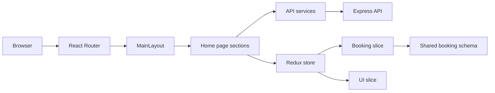

# Web app

This package contains the Salon Shizuka customer-facing site: a single-page React app with Vite, Redux state for the booking flow, SCSS styling, GSAP animations, and API clients for booking and newsletter signup.

## Architecture

## Setup

1. Install dependencies from the repository root with `npm install`.
2. Set `VITE_API_BASE_URL` in `apps/web/.env.development` for local work and `apps/web/.env.production` for deployment.
3. Run `npm run dev:web` from the repository root, or `npm run dev` inside `apps/web`.

The Vite dev server runs on port `5173` and proxies `/api` to `http://localhost:4000`.

## npm scripts

| Script | What it does |
| --- | --- |
| `npm run dev` | Starts the Vite dev server. |
| `npm run build` | Builds the production bundle. |
| `npm run build:deploy` | Builds the deployable bundle used by the Netlify publish directory. |
| `npm run preview` | Serves the production build locally. |
| `npm run lint` | Runs ESLint across the app. |
| `npm run type-check` | Runs the TypeScript compiler without emitting files. |

## Environment variables

| Variable | Required | Purpose |
| --- | --- | --- |
| `VITE_API_BASE_URL` | No in dev, yes in production | Base URL for the API client. Defaults to `/api` when unset. |

### Local values

- `apps/web/.env.development` currently points to `http://localhost:4000`.
- `apps/web/.env.production` currently points to `https://salon-shizuka-production.up.railway.app`.

## App structure

- `src/app/router.tsx` defines the app route tree. The current public experience is the `/` route.
- `src/components` contains the design-system-style primitive, surface, atom, molecule, organism, and template layers.
- `src/features/booking` manages the booking state and selection logic.
- `src/features/newsletter` manages newsletter subscription state.
- `src/services` wraps HTTP calls to the API.
- `src/styles` contains the global SCSS foundation and page styles.
- `deploy/` is the build output published by Netlify.

## Deployment

This app is configured for static deployment.

1. Set `VITE_API_BASE_URL` to the live API host.
2. Run `npm run build:deploy`.
3. Publish the `apps/web/deploy` directory.
4. Keep `netlify.toml`’s redirect rule in place so client-side routing continues to work.

## Related source

- [Documentation index](../../docs/README.md)
- [Root README](../../README.md)
- [Contributing guide](../../docs/CONTRIBUTING.md)
- [API README](../api/README.md)
- [Shared booking schema](../shared/schemas/bookingSchema.ts)
