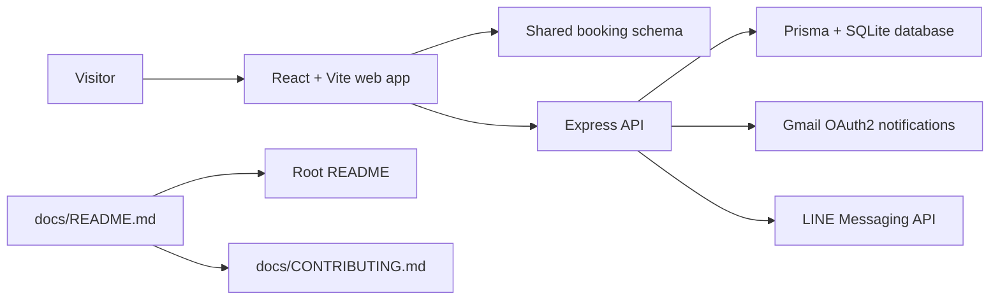

# Salon Shizuka docs

The documentation hub for the repository. If you are looking for setup, architecture, API details, or contribution guidance, this is the fastest place to start.

## At a glance

- **What this project is:** a monorepo with a React/Vite front end, an Express/Prisma API, and shared booking validation.
- **Where to start:** the [root README](../README.md) for the big picture, then the app-level READMEs for implementation details.
- **What stays in sync:** scripts, environment variables, routes, deployment notes, and the shared booking contract.

## Quick links

| Guide | Use it when you need... |
| --- | --- |
| [Root README](../README.md) | the repo overview, architecture, and top-level commands |
| [Web app README](../apps/web/README.md) | Vite setup, front-end scripts, deployment, and client env vars |
| [API README](../apps/api/README.md) | backend setup, endpoints, database, and server env vars |
| [Shared package README](../apps/shared/README.md) | the booking schema contract shared across the stack |
| [Contributing guide](CONTRIBUTING.md) | the working agreement for changes and reviews |

## Project map

## What each guide covers

- `README.md` — architecture, repository layout, root scripts, and deployment overview.
- `apps/web/README.md` — front-end setup, scripts, environment variables, and deploy steps.
- `apps/api/README.md` — backend setup, scripts, env vars, API endpoints, database, and deploy steps.
- `apps/shared/README.md` — shared schema contracts and why they exist.
- `docs/CONTRIBUTING.md` — docs-side mirror of the contribution workflow.
- `CONTRIBUTING.md` — canonical contribution guide for the repo.

## Architecture snapshot

- Front end: React, Vite, Redux, GSAP, SCSS.
- API: Express, Prisma, Zod, Gmail OAuth2, LINE Messaging API.
- Shared contract: booking schema definitions in `apps/shared/schemas/bookingSchema.ts`.

## Maintenance note

- Update the nearest README first when code changes.
- Update this landing page only when the documentation map or subsystem boundaries change.
- Keep the mirror at `docs/CONTRIBUTING.md` aligned with `CONTRIBUTING.md`.
